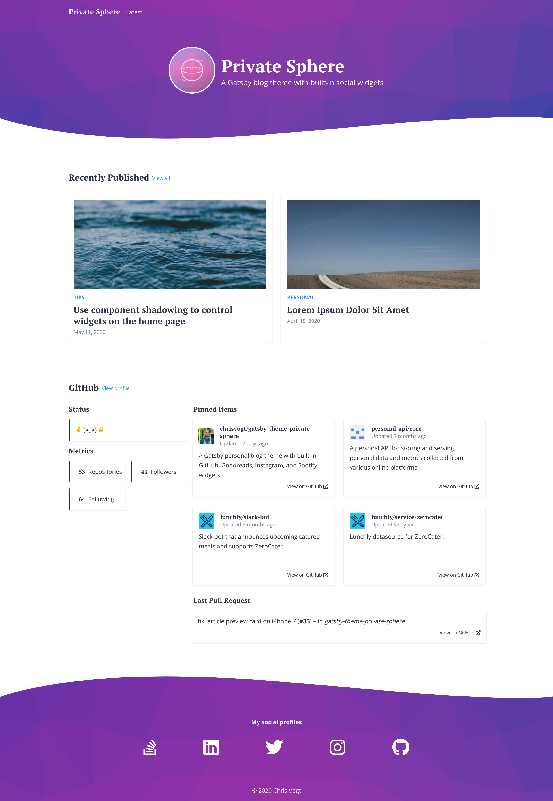

Private Sphere comes with a collection of widgets that render social profile information. To utilize these widgets, you must currently supply your own datasource. To avoid using these widgets altogether, use [GatsbyJS component shadowing](https://www.gatsbyjs.org/blog/2019-04-29-component-shadowing/) to specify which widgets your theme uses.

```javascript{numberLines: true}
# /ROOT/src/gatsby-theme-private-sphere/components/home-widgets.js

import React from 'react'

import GitHub from 'gatsby-theme-private-sphere/src/components/widgets/github'
import RecentPosts from 'gatsby-theme-private-sphere/src/components/widgets/recent-posts'

const HomeWidgets = () => (
  <>
    <RecentPosts />
    <GitHub />
  </>
)

export default HomeWidgets
```

The above file will override the theme's `<HomeWidgets />` component, and cause only the recent posts widget and the GitHub widget to render.


